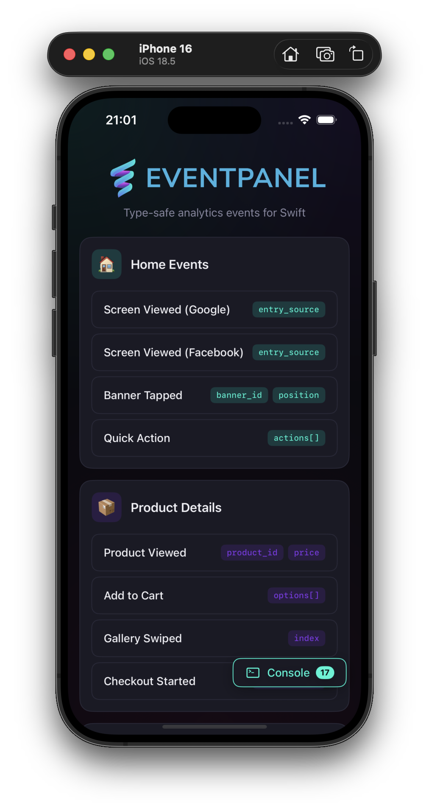
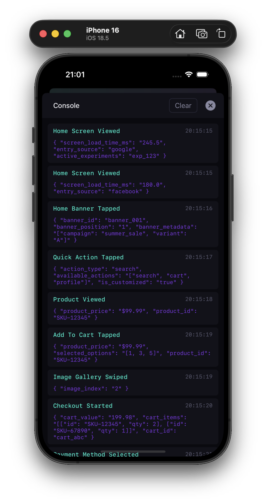

# EventPanel iOS Demo

A demonstration iOS app showcasing EventPanel CLI integration for type-safe analytics event code generation.

<p align="center">
  
  
</p>

## Overview

This demo app demonstrates how to integrate EventPanel CLI into an iOS project to generate type-safe analytics events from YAML configuration files.

## Features

- 🎯 **Type-Safe Analytics**: Generated analytics events with compile-time safety
- 📝 **YAML Configuration**: Event definitions managed through `EventPanel.yaml`
- 🔄 **Code Generation**: Automated Swift code generation from event schemas

## Project Structure

```
DemoApp/
├── Analytics/
│   └── GeneratedAnalyticsEvents.swift  # Generated event code
├── Components/                         # Reusable UI components
├── Services/
│   └── AnalyticsService.swift          # Analytics tracking service
├── Theme/
│   └── Colors.swift                    # App color definitions
├── ContentView.swift                   # Main SwiftUI view
└── DemoAppApp.swift                    # App entry point
```

## Generated Analytics Events

The app includes several example analytics events:

- **Product Details Events**: `productViewed()`, `addToCartTapped()`, `imageGallerySwiped()`, `checkoutStarted()`
- **Checkout Events**: `checkoutCompleted()`, `paymentMethodSelected()` with custom `PaymentMethod` enum
- **Home Events**: `homeScreenViewed()`, `homeBannerTapped()`, `quickActionTapped()` with custom `EntrySource` enum

## Usage

### Setup

1. **Install EventPanel CLI**:
   ```bash
   brew tap eventpanel/eventpanel
   brew install eventpanel
   ```

2. **Generate Analytics Code**:
   ```bash
   eventpanel generate
   ```
   
   **Note**: Code generation is automatically run during Xcode builds via the "GenerateAnalytics" build phase. The build script automatically detects the EventPanel CLI installation path (Homebrew or manual installation).

### Configuration

The app uses `EventPanel.yaml` to define analytics events:

```yaml
workspaceId: 98996b91-79c2-4bfa-9339-f559615cf0d2
source: iOS
plugin:
  swiftgen:
    shouldGenerateType: true
    outputFilePath: DemoApp/Analytics/GeneratedAnalyticsEvents.swift
    eventTypeName: AnalyticsEvent
    namespace: AnalyticsEvents
    documentation: true
events:
- id: vJYxYV2tXEZlGh3I9iB_I  # Product Viewed
- id: 5oYkQpzYj-47TPVna3KtH  # Add To Cart Tapped
- id: gEUfBDQlXGAMcOgYzQ98_  # Image Gallery Swiped
- id: 4KYCSy_Dxo9im1342lj-q  # Checkout Started
- id: c0A7K5TETHfyqBmlNgxzX  # Checkout Completed
- id: ReeBFYaGNMjcSAg5AWNZ6  # Payment Method Selected
- id: 7x_C_nhcvdKoJezy8LRfq  # Home Screen Viewed
- id: CxjfQzKJoTblMNS6Dre16  # Home Banner Tapped
- id: V3IyudkmOanyBk_P6r7wd  # Quick Action Tapped
  version: 2
```

## Example Usage

```swift
// Track a product view
let event = AnalyticsEvents.ProductDetails.productViewed(
    productId: "SKU-123",
    productPrice: "29.99"
)
AnalyticsService.shared.track(event)

// Track home screen with entry source enum
let homeEvent = AnalyticsEvents.Home.homeScreenViewed(
    activeExperiments: "exp_checkout_v2",
    screenLoadTimeMs: 120.5,
    entrySource: .facebook
)
AnalyticsService.shared.track(homeEvent)

// Track payment method selection
let paymentEvent = AnalyticsEvents.Checkout.paymentMethodSelected(
    paymentMetadata: [["provider": "stripe"]],
    paymentMethod: .card,
    supportedMethods: ["card", "cash"]
)
AnalyticsService.shared.track(paymentEvent)
```

## Learn More

- 🚀 [EventPanel CLI](https://github.com/eventpanel/eventpanel-cli)
- 🌐 [EventPanel Website](https://eventpanel.net)
